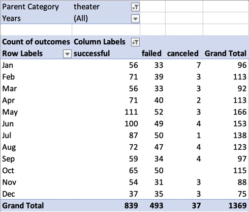
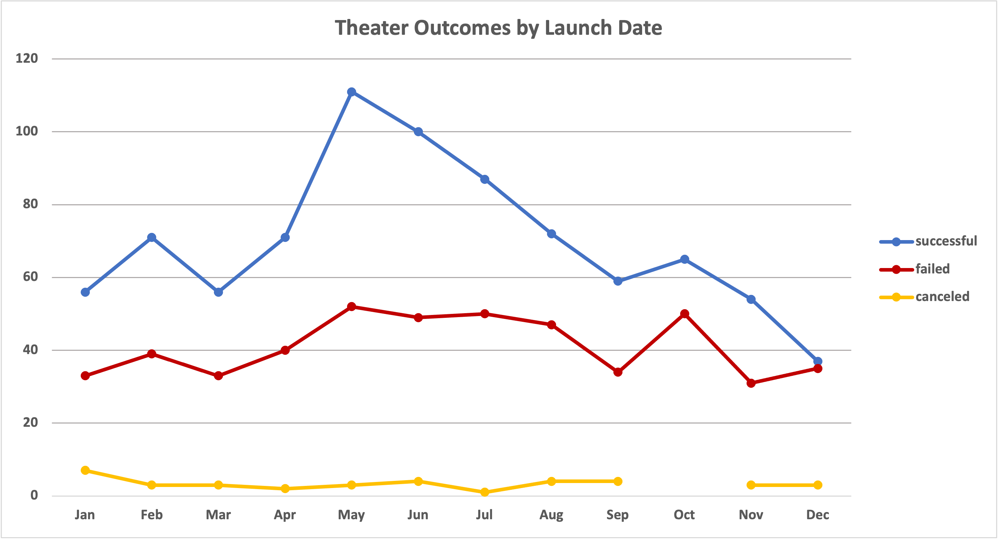
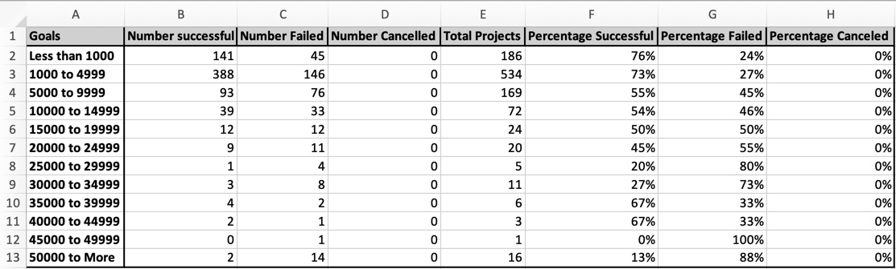
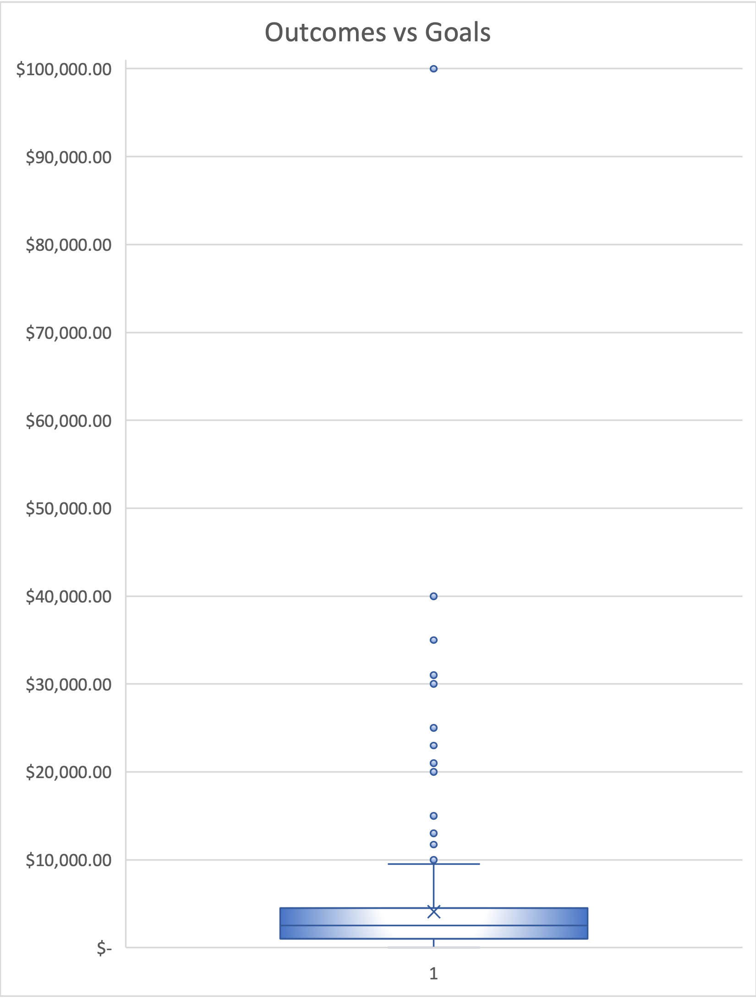
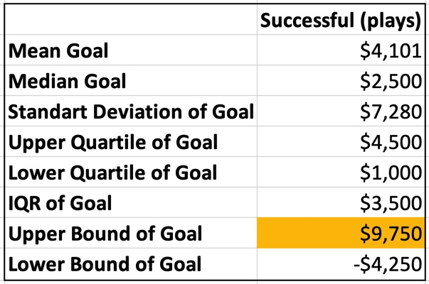
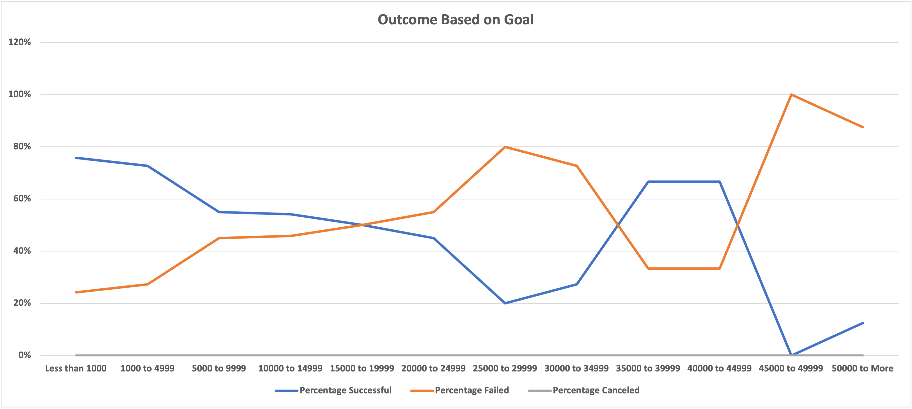

# Kickstarting with Excel

## Overview of Project

This project is carried out at the request of our client, Louise, who is considering launching Kikstarter campaign to support her play “Fever”. The analysis is performed to determine if there are any specific factors related to the success of croudfunding campaigns in theater category on Kickstarter. The source, for the analysis, is the data set of Kickstarter campaigns (over 4000 campaigns) for the period from 2009 till 2017, which is condensed, sorted and visualized through Pivot Tables and Pivot Charts on MS Excel.

### Purpose

The purpose of the analysis is to provide the client with the greater understanding of how different campaigns fared in relation their launch dates and their funding goals, so that she could set her campaign to mirror other successful campaigns in the same category.

## Analysis and Challenges

_Before getting to the analysis, let’s see what formulas were implemented to the dataset, [Kickstarter_Challenge.xlsx](Kickstarter_Challenge.xlsx) and major changes were made._ 

_-	Two columns (“Parent Category” and Subcategory”) were created, and the value was retrieved from column “Category and Subcategory”  were created,_

_-	To round the value in column “Percentage Funded” with standard rule, the following formula was used: =ROUND(E2/D2*100,0),_ 

_-	Unix epoch time, in the dataset was converted into Excel’s date format (6/22/15) by using the following formula: =(((J2/60)/60)/24)+DATE(1970,1,1), and two extra columns were added (“Date created conversion” and “Date ended conversion”),_

_-	Column “Average Donation” was created, and the following formula was implemented =IFERROR(B2/E2,0),_

_-	=YEAR() function was used to retrieve a year corresponding to the date (6/22/15), and column “Year” was added._

As long as the dataset of Kickstarter campaigns illustrates lots of categories which are not related to plays, analysis had to be condensed by creating pivot tables. And, in accordance with the purpose of the project, correlation between outcomes and two specific factors (Launch Date and Funding Goals) was analyzed.

### Analysis of Outcomes Based on Launch Date

After condensing the dataset, the following Pivot Table was created. 

Pivot Tabel 1

This table shows that during the period from 2009 to 2017, 1369 theater campaigns were launched and 839 of them were successful, which constitutes about 61%. Whereas, 36% and 3% are failed and canceled campaigns, respectively. Among month, May and June has the most successful campaigns launched. The differnece between successful and failed campaigns is the biggest in May. It will be better illustrated in the following Pivot Chart.

Pivot Chart 1

This chart clearly shows that quantity of both successful and failed campaigns reached their maximum points in May. After that, quantity of successful campaigns started falling gradually. Whereas the quantity of failed campaigns remained stable till August. In December, successful campaigns hit a low, and it was almost on the same level with failed campaigns. Also, it needs to be stated that the quantity of failed campaigns always fluctuated between 31 and 52. And, the quantity of canceled campaigns was never over 7. Therefore, it is not significant in the analysis.

### Analysis of Outcomes Based on Goals

Now, it is time for correlation between outcomes and goals. The following Pivot Table illustrates how campaigns filtered by "plays" with different funding goals succeeded.

Pivot Table 2

 	

_To build this table the following formula was used: =COUNTIFS(Kickstarter!$D:$D,"<1000",Kickstarter!$F:$F,"failed",Kickstarter!$R:$R,"plays")_

As it can be seen that the percentage of success is over 70% in the range up to $5,000. Whereas, goals from $5,000 to $9,999 have success rate of 55%. And, goals over $10,000 are already outliers. For better illustration let's get to the following Box Whisker and Descriptive Statistics.

Box and Whisker 1

Descriptive Statistics 1

Both chart and table shows that the Upper Bound is $9,750. All point above this level are outliers. Meaning that they are not needed to be considered in the analysis. 

Pivot Chart 2

The chart above shows that as goals rise the success rate goes down.  Due to outliers any fluctuations after the point "$5,000 to $9,999" are not to be considered. 

### Challenges and Difficulties Encountered

The main challenge encountered is sorting, organizing and visualizing the dataset.

## Results

- To conclude it is essential to state that the best month to launch the campaign is May followed by June. 

- Also, it is highly recommended not to launch the campaign in automn and winter.

- It is essential to consider that for higher probability of success to set a funding goal not more that $5,000.

- The main limitation of the dataset is that it does not have recent data. 

- "Box and Whisker 1" and "Descriptive Statistics 1" used above provide better understanding of to what extend charts shows reliable data. 
